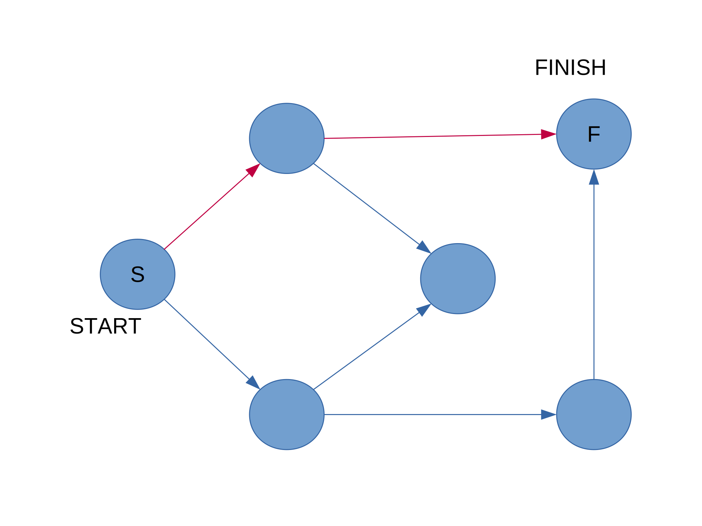
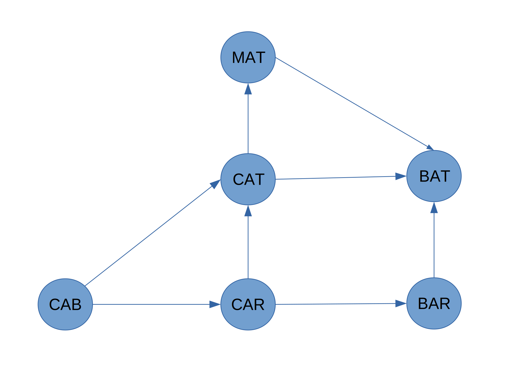
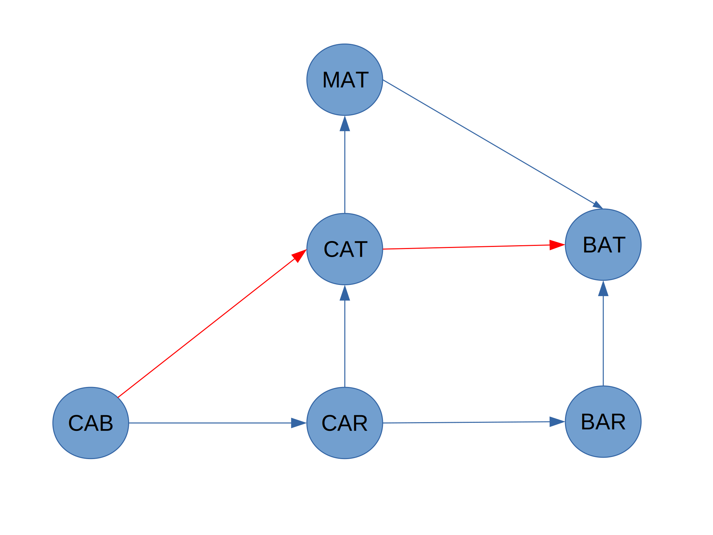
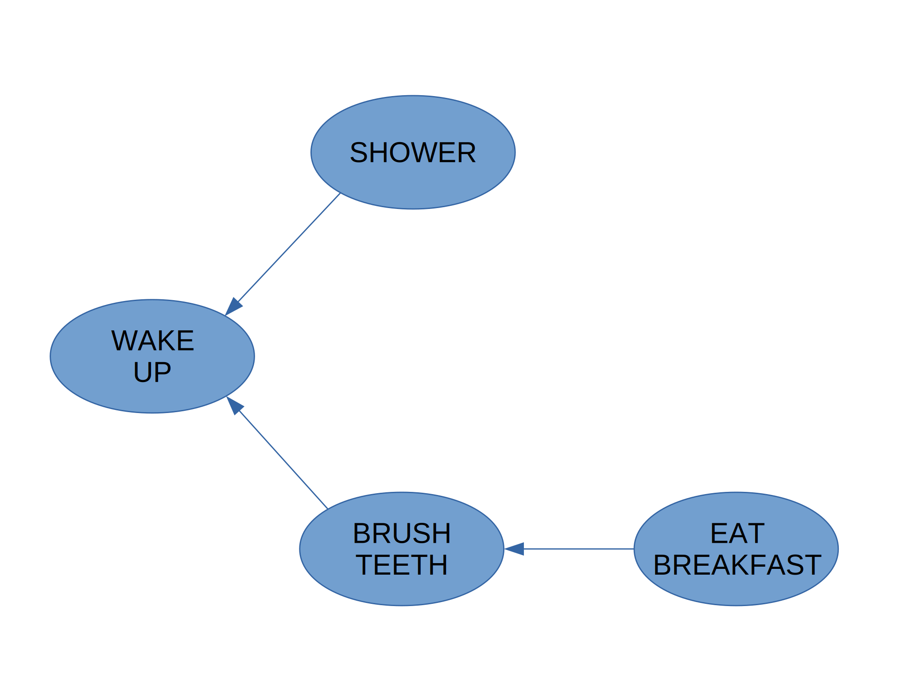
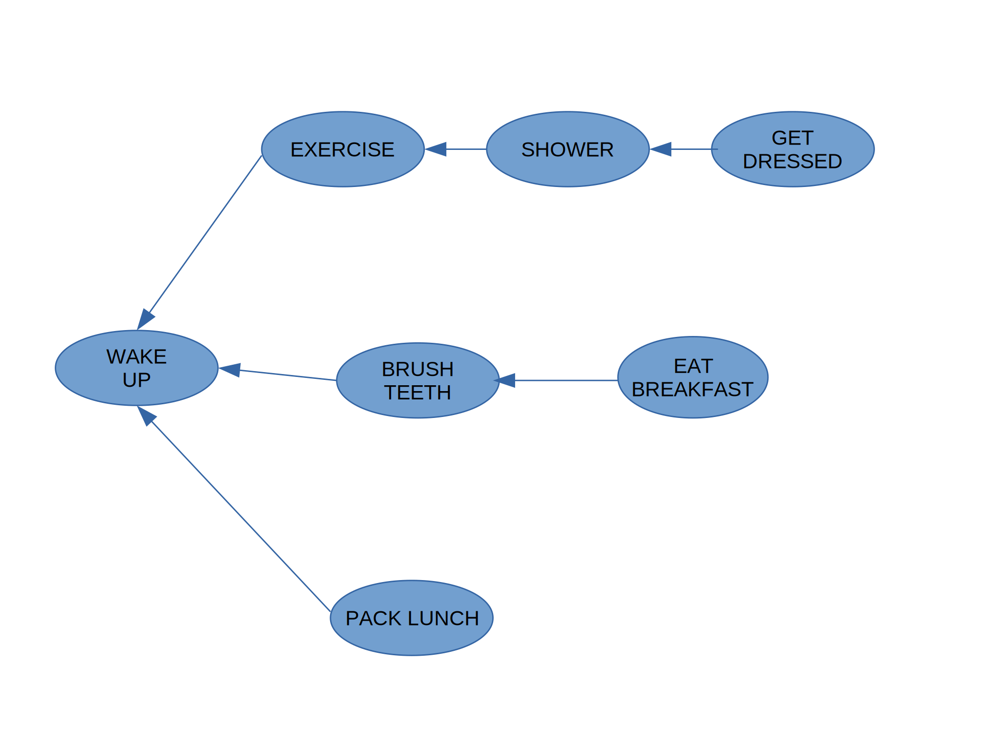
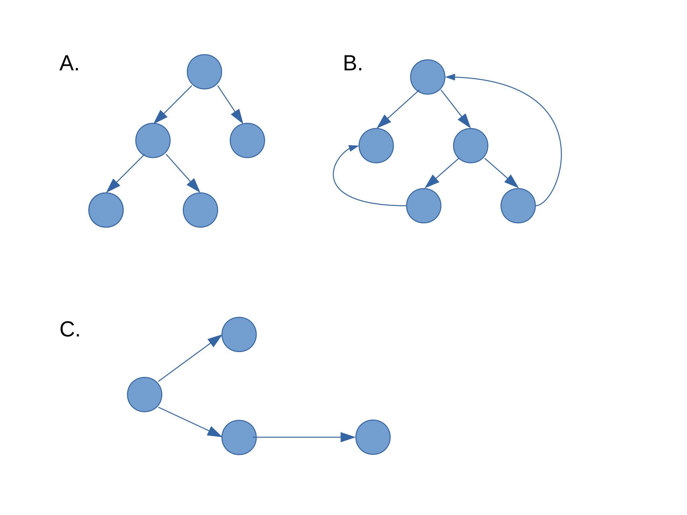

# Exercises

Run the breadth-first search algorithm on each of these graphs to find the solution.

1. Find the length of the shortest path from start to finish.

    

    
    

2. Find the length of the shortest path from "cab" to "bat".

    

    

Here’s a small graph of my morning routine.

   
   
It tells you that I can't eat breakfast until I've brushed my teeth. So "eat
breakfast" depends on "brush teeth".
On the other hand, showering doesn't depend on brushing my teeth,
because I can shower before I brush my teeth. From this graph, you can
make a list of the order in which I need to do my morning routine:

1. Wake up.
2. Shower.
3. Brush teeth.
4. Eat breakfast.

Note that “shower” can be moved around, so this list is also valid:

1. Wake up.
2. Brush teeth.
3. Shower.
4. Eat breakfast.

3. For these three lists, mark whether each one is valid or invalid.

| A                | B                | C                |
|------------------|------------------|------------------|
| 1. Wake up       | 1. Wake up       | 1. Shower        |
| 2. Shower        | 2. Brush Teeth   | 2. Wake up       |
| 3. Eat Breakfast | 3. Eat Breakfast | 3. Brush Teeth   |
| 4. Brush Teeth   | 4. Shower        | 4. Eat Breakfast |
| -- Invalid --    | -- Valid --      | -- Invalid --    |

4. Here’s a larger graph. Make a valid list for this graph.

   

   1. Wake up.
   2. Exercise
   3. Shower.
   4. Get Dressed.
   5. Brush Teeth
   6. Eat breakfast.
   7. Pack Lunch

5. Which of the following graphs are also trees?

   

   A and C