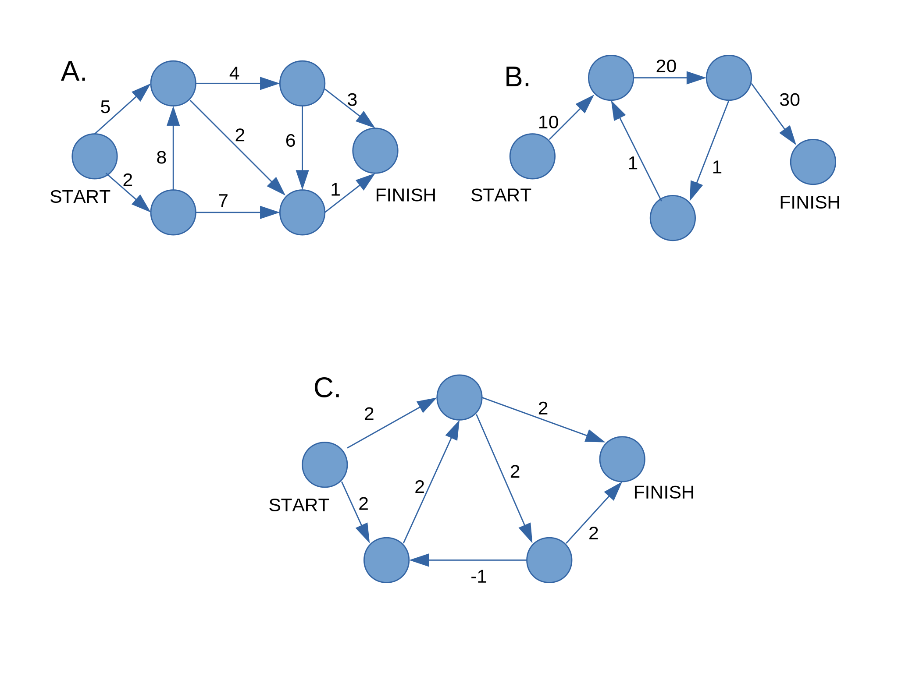

# Exercises

Run the breadth-first search algorithm on each of these graphs to find the solution.

1. In each of these graphs, what is the weight of the shortest path from 
start to finish?

    

   A. 8

   B. 60

   C. Negative-weight cycle
